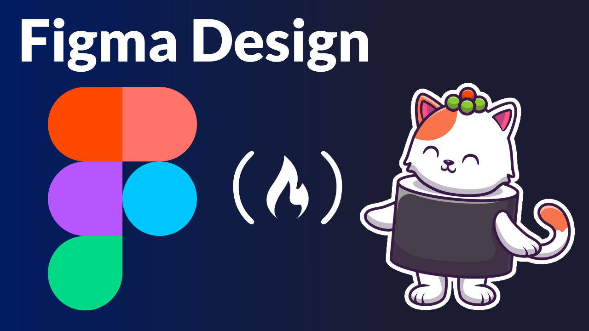

# mockup-and-wireframe

## **Task #2** 📄

## Design a website using **Figma** 
##### Design a **wireframe** and **mockup** for an **E-learning** website using Figma online tool 💻📚
#
* ### **TOOLS ⚙️**
    *  **Figma** online tool 

## **📎 Links:**

▷ [Wireframe](https://www.figma.com/file/z3HO0iz25kPjxfNoico1KZ/E-Learning-Wireframe?node-id=0%3A1&t=Ma7yP72HFF8XRWWF-1)
  
▷ [MockUp](https://www.figma.com/file/DBiSlNBfv1UHqJ23xGVujH/MockUp?node-id=0%3A1&t=krvNFjxIrtt2QFlr-1)
#

***AWBGCE*** 🌼❤️ AMANI ZYOUD 

